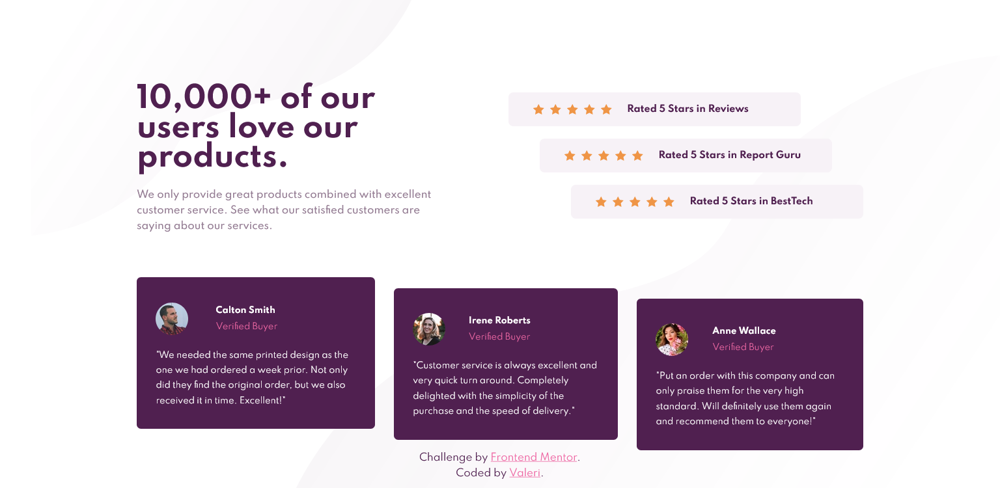

# Frontend Mentor - Social proof section solution

This is a solution to the [Social proof section challenge on Frontend Mentor](https://www.frontendmentor.io/challenges/social-proof-section-6e0qTv_bA). Frontend Mentor challenges help you improve your coding skills by building realistic projects.

## Table of contents

-   [Overview](#overview)
    -   [The challenge](#the-challenge)
    -   [Screenshot](#screenshot)
    -   [Links](#links)
-   [My process](#my-process)
    -   [Built with](#built-with)
    -   [Useful resources](#useful-resources)
-   [Author](#author)

## Overview

### The challenge

Users should be able to:

-   View the optimal layout for the section depending on their device's screen size

### Screenshot

### Mobile design

### Desktop design

### Links

-   Solution URL: [Frontend Mentor](https://www.frontendmentor.io/solutions/social-proof-section-SwigxYFlY)
-   Live Site URL: [Social proof section](https://social-proof-section-front-end-mentor.netlify.app/)

## My process

### Built with

-   Semantic HTML5 markup
-   CSS custom properties
-   Flexbox
-   CSS Grid
-   Mobile-first workflow

### Useful resources

-   [browser-sync](https://www.npmjs.com/package/browser-sync) - npm package for live server.
-   [sass](https://www.npmjs.com/package/sass) - npm package is a distribution of Dart Sass. Sass makes CSS fun again.
-   [autoprefixer](https://www.npmjs.com/package/autoprefixer) - PostCSS plugin to parse CSS and add vendor prefixes to CSS rules using values from Can I Use.
-   [group-css-media-queries](https://www.npmjs.com/package/group-css-media-queries) CSS postprocessing: group media queries.
-   [google-webfonts-helper](https://google-webfonts-helper.herokuapp.com/fonts) - A Hassle-Free Way to Self-Host Google Fonts.

## Author

-   Frontend Mentor - [@Valeri85](https://www.frontendmentor.io/profile/Valeri85)
-   Twitter - [@Valeri](https://www.twitter.com/Valeri79125128)
